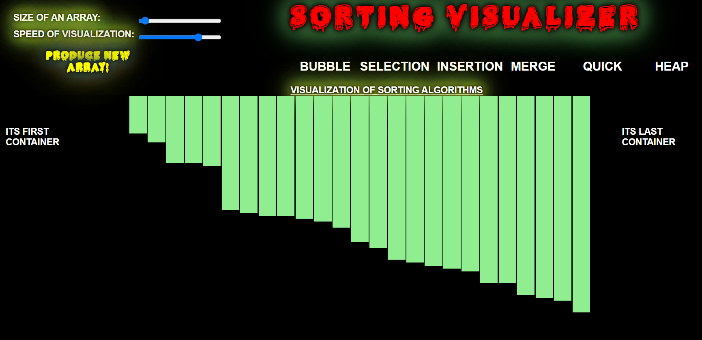

***This new Web application is created by Ankita Sikder and other group members, special credit goes to Biswarup Bhattacharjee, student of BTECH, in University of Engineering and Management, Kolkata.***  

**Email Id: ankita.sikder14@gmail.com.** 

**Contact No: 8583939774.** 

<p align="left">
<a href="https://facebook.com/ankita.sikder.104" target="blank"></a>
<a href="https://instagram.com/ankita.sikder14" target="blank"></a>
<a href="https://github.com/biswa2210/ankitasikder" target="blank"></a>
</p>

# ALGORIHMS-VIUALIZER-PART :star_struck: :computer:

[](https://shields.io/) [](https://shields.io/) [](https://shields.io/)

## About :point_down: 

<div align="justified">
   
*It is the functionality 1 of my project.* Algorithm-visualizer is a web app written in React. It contains UI components and interprets commands into visualizations. Here are two types of algorithms, searching and sorting. Here user will get a tutorial for using this web application. Here we can set the size, speed, name of algorithm them it will show how the algorithm actually works. I have made this website to easily study algorithms.
</div>

## LINK of full project: :point_right: https://algo-visualize-login-signup.vercel.app/login

## Why I have made this :point_down:

<div align="justified">
   
There are two principal applications of algorithm visualization: research and education. Potential benefits for researchers are based on expectations that algo-rithm visualization may help uncover some unknown features of algorithms. For example, one researcher used a visualization of the recursive Tower of Hanoi algo-rithm in which odd- and even-numbered disks were colored in two different colors. He noticed that two disks of the same color never came in direct contact during the algorithm’s execution. This observation helped him in developing a better non-recursive version of the classic algorithm. The application of algorithm visualization to education seeks to help students learning algorithms. The available evidence of its effectiveness is decisively mixed. Although some experiments did register positive learning outcomes, others failed to do so. The increasing body of evidence indicates that creating sophisticated software systems is not going to be enough. In fact, it appears that the level of student involvement with visualization might be more important than specific features of visualization software. In some experiments, low-tech visualizations prepared by students were more effective than passive exposure to sophisticated software systems.Learning an algorithm gets much easier with visualizing it. So it is a great way to study and understand algotihms.
</div>

## Folder Structure :point_down:

```bash
Functionality1
   |
   └── algo-visualize
            ├── Searching-Visualizer
            └── Sorting-Visualizer

```                       

## Some Points :point_down:

It has been created using advance JavaScript, advance CSS3, SCSS, ReactJS, advance HTML5, nodejs. It is fully responsive.<br>
For references for algorithms I have used [geeksforgeeks](https://www.geeksforgeeks.org/) and [wikipedia](https://www.wikipedia.org/). 

## Screenshots of this part:point_down: 

<div align="center">
   
 <a href="s1.PNG"></a> <a href="s2.PNG"></a>

<a href="s3.PNG"></a> <a href="s4.PNG"></a>

<a href="s5.PNG"></a> <a href="s6.PNG"></a>

<a href="s16.PNG"></a>
</div>
