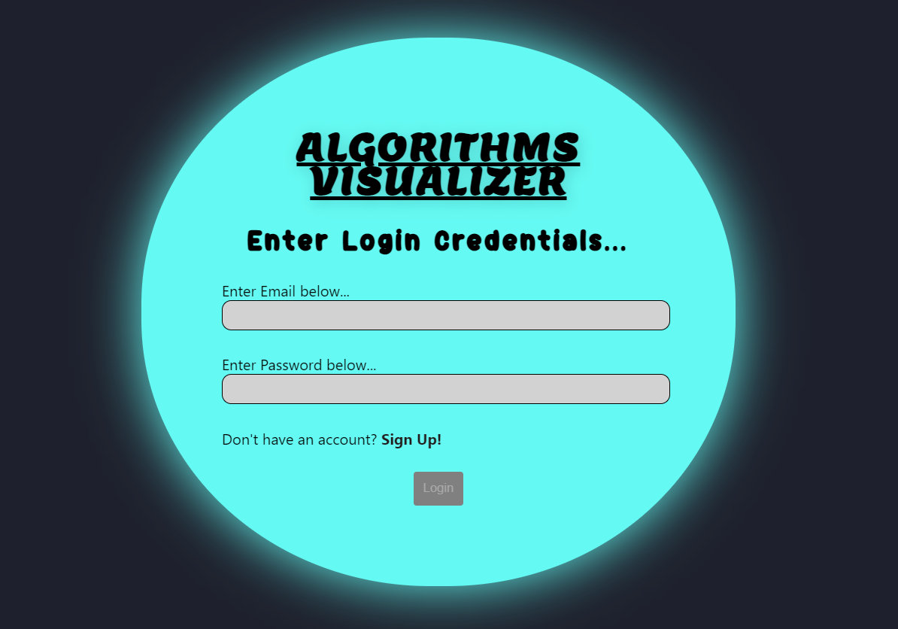
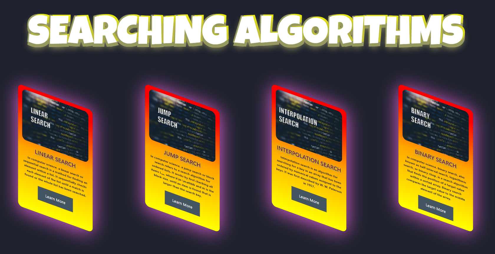
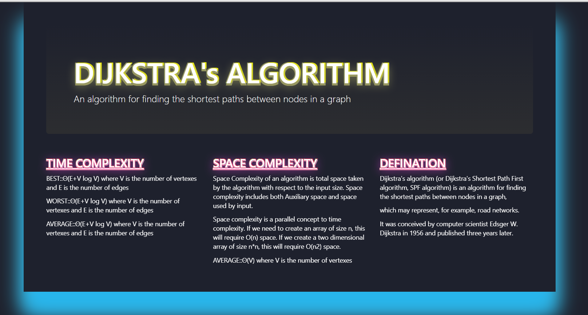

***This new Web application is created by Ankita Sikder and other group members, special credits goes to Biswarup Bhattacharjee, student of BTECH, in University of Engineering and Management, Kolkata.***

**Email Id: ankita.sikder14@gmail.com.** 

**Contact No: 8583939774.** 

<p align="left">
<a href="https://facebook.com/ankita.sikder.104" target="blank"></a>
<a href="https://instagram.com/ankita.sikder14" target="blank"></a>
<a href="https://github.com/biswa2210/ankitasikder" target="blank"></a>
</p>

# ALGORIHMS-PART :computer:

[](https://shields.io/) [](https://shields.io/) [](https://shields.io/)


## About this part :point_down: 

<div align="justified">
 
*It is the 2nd functionality of my project.*  Algorithms are always unambiguous and are used as specifications for performing calculations, data processing, automated reasoning, and other tasks. As an effective method, an algorithm can be expressed within a finite amount of space and time, and in a well-defined formal language for calculating a function. In mathematics and computer science, an algorithm is a finite sequence of well-defined, computer-implementable instructions, typically to solve a class of problems or to perform a computation. Starting from an initial state and initial input (perhaps empty), the instructions describe a computation that, when executed, proceeds through a finite number of well-defined successive states, eventually producing "output" and terminating at a final ending state. The transition from one state to the next is not necessarily deterministic; some algorithms, known as randomized algorithms, incorporate random input. The concept of algorithm has existed since antiquity. Arithmetic algorithms, such as a division algorithm, was used by ancient Babylonian mathematicians c. 2500 BC and Egyptian mathematicians c. 1550 BC. Greek mathematicians later used algorithms in 240 BC in the sieve of Eratosthenes for finding prime numbers, and the Euclidean algorithm for finding the greatest common divisor of two numbers. Arabic mathematicians such as al-Kindi in the 9th century used cryptographic algorithms for code-breaking, based on frequency analysis. This part provides 72 cards containing details of different algorithms. Here are 3 types of algorithms, searching, sorting and others.
</div>

## LINK : :point_right: https://algo-visualize-algorithms.netlify.app/

## Why I have made this :point_down:

<div align="justified">
 
Learning an algorithm gets much easier with getting compact details without searching in goolge or in any book. So it is a great way to study and understand algotihms. Computer scientists learn by experience. We learn by seeing others solve problems and by solving problems by ourselves. Being exposed to different problem-solving techniques and seeing how different algorithms are designed helps us to take on the next challenging problem that we are given. By considering a number of different algorithms, we can begin to develop pattern recognition so that the next time a similar problem arises, we are better able to solve it. That is why we should learn algorithms. 
</div>

 ## Folder Structure :point_down:
 
 ```bash
 Functionality2
   |
   └── algo-catalog
            ├── public    
            └── src
                 ├── customImages
                 ├── Others
                 ├── othersimages
                 ├── searching
                 ├── sorting
                 ├── sortingimages
                 ├── Algorithms.js
                 ├── NotFound.js
                 ├── delayed.jsx
                 ├── index.css
                 ├── index.js
                 ├── searching.js
                 └── sorting.js
```
## Some Points :point_down:

It has been created using advance JavaScript, advance CSS3, SCSS, ReactJS, advance HTML5, Vercel, Firebase, Chat Engine XDK, nodejs and Formik. It is fully responsive. For references for algorithms I have used [geeksforgeeks](https://www.geeksforgeeks.org/) and [wikipedia](https://www.wikipedia.org/). For all custom images in algorithms part I have used [photoshop](www.adobe.com/Adobe/Photoshop). 

## Screenshots of this part :point_down: 

<div align="center">
 
<a href="s1.PNG"></a> <a href="s2.PNG"></a>

<a href="s7.PNG"></a> <a href="s8.PNG"></a>

<a href="s9.PNG"></a> <a href="s10.PNG"></a>

<a href="s16.PNG"></a>

</div>

