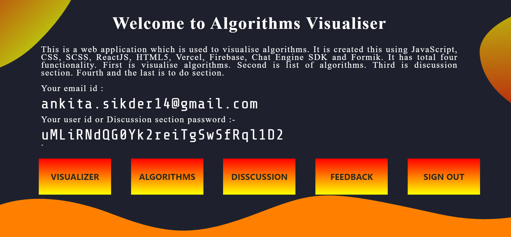
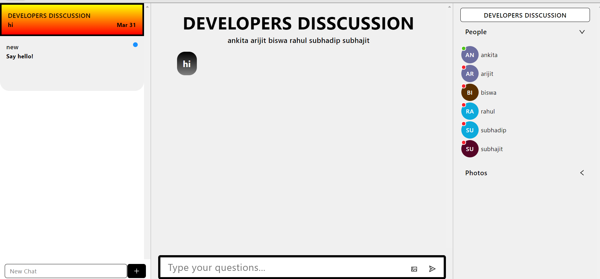

***This new Web application is created by Ankita Sikder and other group members, special credits goes to Biswarup Bhattacharjee, student of BTECH, in University of Engineering and Management, Kolkata.***

**Email Id: ankita.sikder14@gmail.com.** 

**Contact No: 8583939774.** 

<p align="left">
<a href="https://facebook.com/biswarup.bhattacharjee.5811" target="blank"></a>
<a href="https://instagram.com/biswarup2210" target="blank"></a>
<a href="https://github.com/biswa2210/biswa2210" target="blank"></a>
</p>

# DISCUSSION-PART :star_struck: :computer: :speech_balloon: :bookmark:

[](https://shields.io/) [](https://shields.io/) [](https://shields.io/)

## About this part :point_down: 

<div align="justified">
            
*It is the 3rd functionality of my project.* Messaging apps are apps and platforms that enable instant messaging. Many such apps have developed into broad platforms enabling status updates, chatbots, payments and conversational commerce (e-commerce via chat). They are normally centralised networks run by the servers of the platform's operators, unlike peer-to-peer protocols like XMPP. The DISCUSSION part will take the user to a login page where he has to give username and password (firebase-provided password in home page). Then he will be added in a discussion group for doubt clearing where I will answer his questions regarding this website. Here user can send messages and images in chat. Click on discussions. Here user has to enter his username and password (firebase-provided password in home page). Then he will be added in a discussion group for doubt clearing where the developers will answer his questions regarding this website.
</div>

## LINK : :point_right: https://algo-visualize-disscussion.netlify.app/

## Why I have made this :point_down:

<div align="justified">
            
Discussion is important for any queries of user. Group discussion on study topics plays vital role in understanding the topic. Discussing a topic with friends or classmates helps in learning the topic with perfection. Group discussion on a topic involves sharing of learning by the participants which equally benefits all the participants. I have made this to make study easier. When developers guide the user properly it will very helpful for the user to explore the web site and study algorithms.
</div>

## Folder Structure :point_down:

```bash
Functionality3
    └── discussionpart
            ├── public
            └── src
                 ├── componenents
                 |       ├── ChatFeed.jsx
                 |       ├── LoginForm.jsx
                 |       ├── MessageForm.jsx
                 |       ├── MyMessage.jsx
                 |       └── TheirMessage.jsx
                 ├── App.css
                 ├── App.js
                 └── index.js
```                 
## Some Points :point_down:

It has been created using advance JavaScript, advance CSS3, SCSS, ReactJS, advance HTML5, Firebase, Chat Engine XDK, nodejs and Formik. It is fully responsive. For chatting I have used [chat engine](https://chatengine.io/). For password I have used [firebase](https://firebase.google.com/).

## Screenshots :point_down: 

<div align="center">
 
<a href="s1.PNG"></a> <a href="s2.PNG"></a>

<a href="s11.PNG"></a> <a href="s16.PNG"></a>
</div>


