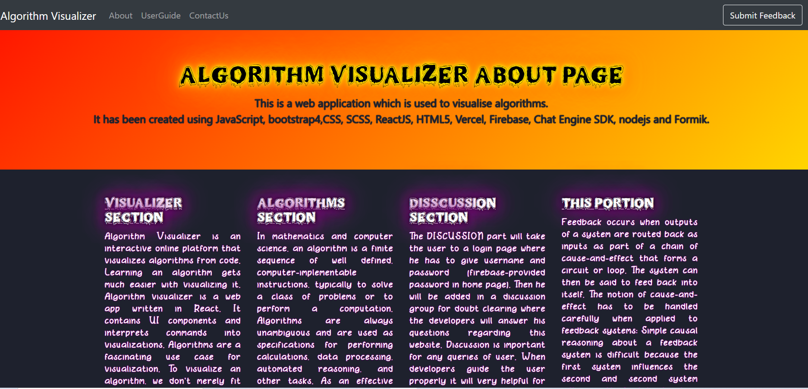
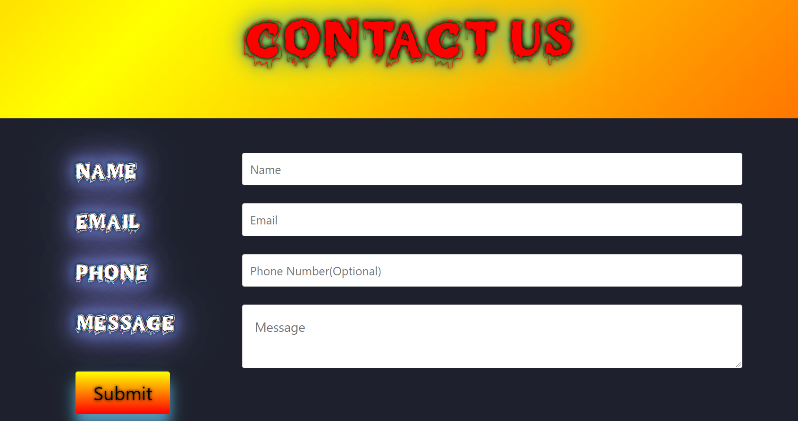

***This new Web application is created by Ankita Sikder and other group members, special credits goes to Biswarup Bhattacharjee, student of BTECH, in University of Engineering and Management, Kolkata.*** 
 
**Email Id: ankita.sikder14@gmail.com.** 

**Contact No: 8583939774.** 

<p align="left">
<a href="https://facebook.com/biswarup.bhattacharjee.5811" target="blank"></a>
<a href="https://instagram.com/biswarup2210" target="blank"></a>
<a href="https://github.com/biswa2210/biswa2210" target="blank"></a>
</p>

# FEEDBACK-PART :clipboard: :computer:

[](https://shields.io/) [](https://shields.io/) [](https://shields.io/) [](https://shields.io/) [](https://shields.io/) 

## About this part :point_down: 

<div align="justified">
            
*It is the 4 th functionality of my project.* Website feedback is information obtained directly from website users—through on-page surveys, feedback widgets, and other techniques—to help organizations understand what people think (and how they feel) about their websites and landing pages. It has 4 pages containing algorithms visualizer overview, about the 4 functionalities, userguide, contact us portion. There is also an option to send feedback about this web application. Clicking on feedback user can read about my web app. User can write about how much this website is useful or any idea for improvement in this website in contact us section. In send feedback portion user can give feedback.
</div>

## LINK : :point_right: https://algo-visualize-feedback.netlify.app/

## Why I have made this :point_down:

<div align="justified">
            
I have added this section because here user can read about this web application, user guide which will be helpful for him. I have given feedback area so that user can write to me about my algo visualizer project. User's feedback is important to me because only in this way I can know how I should make my work more advance. User's feedback is important to me because only in this way I can know how I should make my work more advance. I can understand if my web app is helpful to users or not.
</div>

## Folder Structure :point_down:

```bash
Functionality4
     └── feedback
            ├── public
            ├── src
            |     ├── components
            |     |     └── Navbar.js
            |     ├── fonts
            |     └── pages
            |           ├── About.js
            |           ├── Contact.js
            |           ├── home.js
            |           ├── Userguide.js
            |           ├── feedback.js
            |           └── err404.js
            └── service
                  └── firebase.js
```

## Screenshots of this part :point_down: 
<div align="center">
            
<a href="s1.PNG"></a> <a href="s2.PNG"></a>

<a href="s12.PNG"></a> <a href="s13.PNG"></a>

<a href="s14.PNG"></a> <a href="s15.PNG"></a>

<a href="s16.PNG"></a>

</div>


