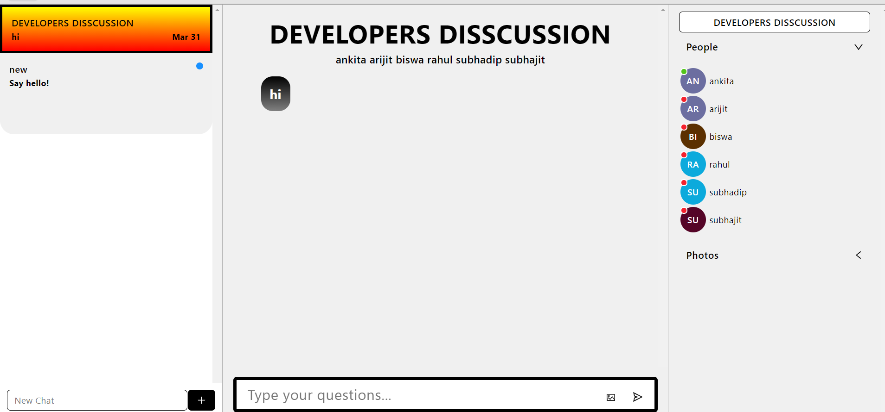

***This new Web application is created by Ankita Sikder and other group members, special credit goes to Biswarup Bhattacharjee, student of BTECH, in University of Engineering and Management, Kolkata.***

**Email Id: ankita.sikder14@gmail.com.** 

<p align="left">  
<a href="https://facebook.com/ankita.sikder.104" target="blank"></a>
<a href="https://instagram.com/ankita.sikder14" target="blank"></a>
<a href="https://github.com/biswa2210/ankitasikder" target="blank"></a>
</p>

# ALGORITHMS-VIUALIZER-WEB-APPLICATION :computer: :iphone: :e-mail: :bookmark_tabs: 

[](https://shields.io/) [](https://shields.io/) [](https://shields.io/) [](https://shields.io/) [](https://shields.io/) 
 
## About this project :point_down: 

<div align="justified">
  
**I have made this project along with the other group members. The names are written in developers area in research paper.** *This is the project of second year fourth semester*. This is a web application which is used to visualise algorithms. User can approach this website through a provided link. First of all it has a sign up or login page. If user is opening it for first time he has to select sign up option. Here he has to give username, email id, password, verify password. If he has already signed up, then he has to go to login option and then he has to give email, password, confirm password. Then you have entered in the main page or home page. Here user can see your email id and a firebase-provided password. Here four buttons are given. VISUALIZE ALGORITHMS, ALGORITHMS, DISCUSSION, FEEDBACK. By clicking on VISUALIZE ALGORITHMS user can watch and understand working of some specific algorithms. If user goes to ALGORITHMS he can see total _72_ algorithms. Sorting, Searching and Others algorithms. If he clicks any of them in learn more button then their details will be shown in a page. The DISCUSSION part will take the user to a login page where he has to give username and password (firebase-provided password in home page). Then he will be added in a discussion group for doubt clearing where the developers will answer his questions regarding this website. In the feedback portion user can write about how much this website is useful or any idea for improvement in this website in the comment section.  
</div>

## LINKS :point_down:

**:point_right: [click here to read Project2 Research Paper](https://github.com/ankitasikder/PROJECT-2-UEMK-AV/blob/main/4thSemProject2ResearchPaper.pdf)<br>
:point_right: [click here to see Project2 PowerPoint Presentation](https://github.com/ankitasikder/PROJECT-2-UEMK-AV/blob/main/CSE2023_GROUP%2042.pptx)<br>**
***PROJECT--\>https://algo-visualize-login-signup.vercel.app/login***

## RESEARCH PAPER PUBLISHED IN IJRESM ON Web-Based Dynamic Algorithm Visualizer Along with Chat Engine SDK for Neophytes 

**https://journals.resaim.com/ijresm/article/view/1290/
https://journals.resaim.com/ijresm/article/view/1290/1234/**

## Why I have made this project :point_down:

<div align="justified">
 
There are two principal applications of algorithm visualization: research and education. Potential benefits for researchers are based on expectations that algo-rithm visualization may help uncover some unknown features of algorithms. For example, one researcher used a visualization of the recursive Tower of Hanoi algo-rithm in which odd- and even-numbered disks were colored in two different colors. He noticed that two disks of the same color never came in direct contact during the algorithm’s execution. This observation helped him in developing a better non-recursive version of the classic algorithm. The application of algorithm visualization to education seeks to help students learning algorithms. The available evidence of its effectiveness is decisively mixed. Although some experiments did register positive learning outcomes, others failed to do so. The increasing body of evidence indicates that creating sophisticated software systems is not going to be enough. In fact, it appears that the level of student involvement with visualization might be more important than specific features of visualization software. In some experiments, low-tech visualizations prepared by students were more effective than passive exposure to sophisticated software systems. Using this web application user can stusy interesting things about algorithms and learn how they actually work.
</div>

## Folder Structure :point_down:

```bash
├── PROJECT-2-UEMK
│   ├── Functionality1
│   │       └── algo-visualize
│   |            ├── Searching-Visualizer
│   |            └── Sorting-Visualizer
│   ├── Functionality2
│   |       └── algo-catalog
│   ├── Functionality3
│   |       └── discussionpart
|   └── Functionality4
|           └── feedback
|
└── algo-visualize-loginsignup
```

## Some Points :point_down:

I have created using advance JavaScript, advance CSS3, SCSS, ReactJS, advance HTML5, Vercel, Firebase, Chat Engine XDK, nodejs and Formik. It is fully responsive.<br>
I have used @mediascreens for making it responsive. I have used [nodejs](https://nodejs.org) and [vercel](https://vercel.com).<br>
I have used blob effect in css and [svg](https://en.wikipedia.org/wiki/Scalable_Vector_Graphics) in the main page.<br>
For references for algorithms I have used [geeksforgeeks](https://www.geeksforgeeks.org/) and [wikipedia](https://www.wikipedia.org/).<br>
For all custom images in algorithms part I have used [photoshop](www.adobe.com/Adobe/Photoshop).<br>
For backend I have used [firebase](https://firebase.google.com/) which provides a user secret to every user which they use for discussion portion.
In discussion part for chatting I have used [chat engine](https://chatengine.io/) and I have made a project in api which provides our project secret key.<br>

## Screenshots :point_down: 

<div align="center">
<a href="pics/s1.PNG"></a> <a href="pics/s2.PNG"></a>

<a href="pics/s3.PNG"></a> <a href="pics/s4.PNG"></a>

<a href="pics/s5.PNG"></a> <a href="pics/s6.PNG"></a>

<a href="pics/s7.PNG"></a> <a href="pics/s8.PNG"></a>

<a href="pics/s9.PNG"></a> <a href="pics/s10.PNG"></a>

<a href="pics/s11.PNG"></a> <a href="pics/s12.PNG"></a>

<a href="pics/s13.PNG"></a> <a href="pics/s14.PNG"></a>

<a href="pics/s15.PNG"></a> <a href="pics/feed.PNG"></a> 

<a href="pics/back.PNG"></a> <a href="pics/s16.PNG"></a>
</div>

## Block Diagram of Project :point_down:

<div align="center">
<a href="pics/bl2.PNG"></a>
</div>

